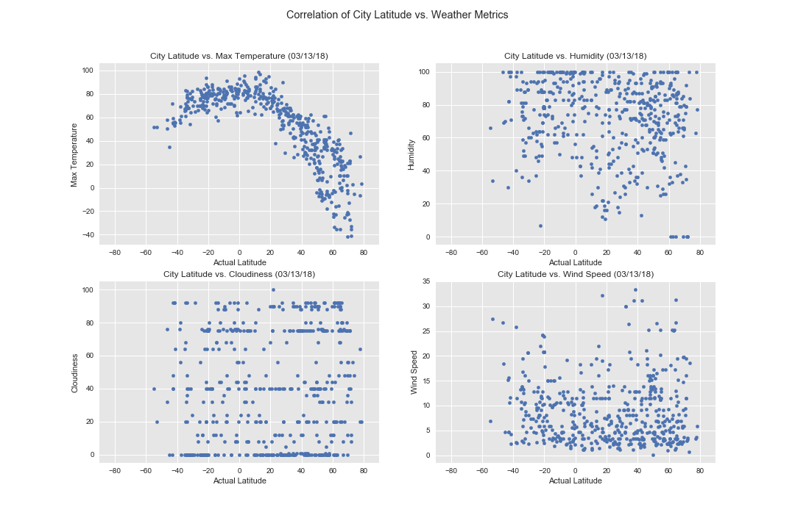

# Unit 6 | Assignemtn -What's the Weather Like?

If you want to run the code, please install Python package citipy and geopy.

Since the log file is very long, I added an option in code to log to a log file: [weather_py.log](weather_py.log)

* [WeatherPy.ipynb](WeatherPy.ipynb)
* [WeatherPy.md](WeatherPy.md)

Output Files:

* [weather_py.csv](weather_py.csv)
* 

