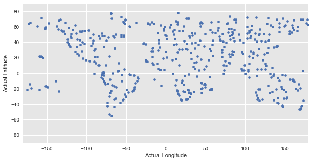
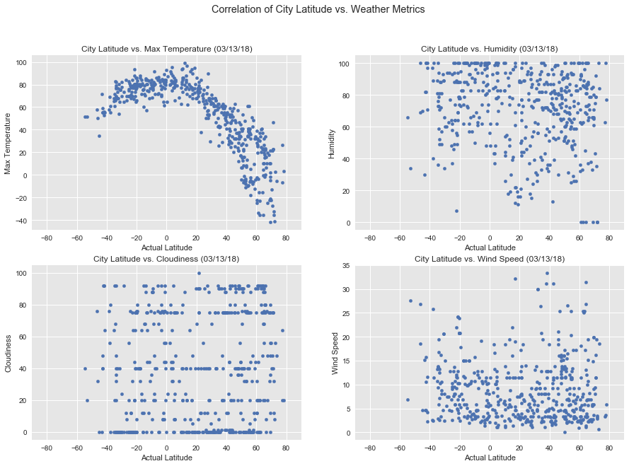
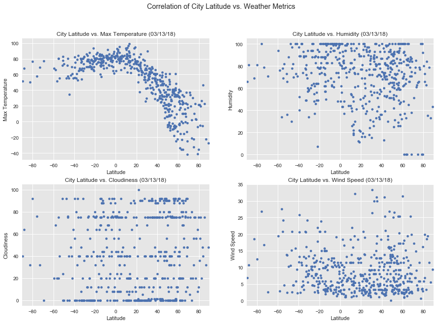

## Analysis

1. On South Hemisphere, there are much fewer cities at higher laptitude
2. On South Hemisphere, temperate drop slower with laptitude than North Hemisphere. This might be because the it is winter at North but summer at South right now.
3. Humidity level by average looks higher on North vs. South Hemisphere. This might also due to seasons.
4. No apparent patterns obsered from scatter plots for couldiness and wind speed
**Note**: I use following method to retrieve the actual latitude and longitude of the cities, as by chance it is more likely a random picked coordinate is in the middle of ocean:

```python
from citipy.citipy import WORLD_CITIES_DICT
CITIES_LAT_LON_DICT = {city: lat_lon for lat_lon, city in WORLD_CITIES_DICT.items()}

(actual_lat, actual_lon) = CITIES_LAT_LON_DICT[city]
```


```python
import os
import requests
import random
import pandas as pd
from datetime import date
import matplotlib.pyplot as plt
import seaborn as sns
from citipy import citipy
from citipy.citipy import WORLD_CITIES_DICT
CITIES_LAT_LON_DICT = {city: lat_lon for lat_lon, city in WORLD_CITIES_DICT.items()}

from config import WOM_API_KEY

class WeatherPy(object):
    
    _number_of_cities = None
    _cities_set = set()
    _cities_df = pd.DataFrame()
    _log_file = None
    _csv_file = None
    _png_file = None
    _actual_png_file = None
    _base_url = 'http://api.openweathermap.org/data/2.5/weather?units=Imperial&APPID=' + WOM_API_KEY + '&q='
    _today = date.today().strftime('%m/%d/%y')
    
    @property
    def cities(self):
        return self._cities_df.reset_index()[[
            'City Name', 'Country Code', 'Date',
            'Latitude', 'Longitude', 'Actual Latitude', 'Actual Longitude',
            'Humidity', 'Max Temperature', 'Cloudiness', 'Wind Speed'
        ]]

    @property
    def number_of_cities(self):
        return self._number_of_cities
      
    def __init__(self, 
                 number_of_cities=None,
                 log_file=None,
                 csv_file=None,
                 png_file=None,
                 actual_png_file=None):
        self._number_of_cities = number_of_cities or 4 # Default to 4 for testing
        self._png_file = png_file
        self._actual_png_file = actual_png_file
        self._csv_file = csv_file
        if log_file:
            self._log_file = open(log_file, 'w')
        sns.set()
        sns.set_style('darkgrid', {'axes.facecolor': '0.9'})
        
    def __del__(self):
        if self._log_file:
            self._log_file.close()

    def _pick_a_city(self, i):
        while True:
            lat, lon = (random.uniform(-90, 90), random.uniform(-180, 180))
            city = citipy.nearest_city(lat, lon)
            (actual_lat, actual_lon) = CITIES_LAT_LON_DICT[city]
            city_name = city.city_name
            country_code = city.country_code
            city_full = city_name + ',' + city.country_code

            self.log('Processing City # {} | {}'.format(i, city_full))

            # Check if city is already picked
            if city_full in self._cities_set:
                self.log('Skip duplicate {}'.format(city_full))
                continue
            
            # Check weather
            url = self._base_url + city_full
            self.log(url)
            response = requests.get(url)
            if response.status_code != 200:
                self.log('Weather not found for ' + city_full + '. Try another city.')
                continue

            w = response.json()   
            self._cities_df = self._cities_df.append(
                pd.DataFrame([{
                        'City Name': city_name,
                        'Country Code': country_code,
                        'Date': self._today,
                        'Latitude': lat,
                        'Longitude': lon,
                        'Actual Latitude': actual_lat,
                        'Actual Longitude': actual_lon,
                        'Humidity': w['main']['humidity'],
                        'Max Temperature': w['main']['temp_max'],
                        'Wind Speed': w['wind']['speed'],
                        'Cloudiness': w['clouds']['all'],
                    }]
                )
            )

            self._cities_set.add(city_full)
            break
        
    def pick_all_cities(self):
        for i in range(self.number_of_cities):
            self._pick_a_city(i)
        
    def write_data_to_csv(self, csv_file=None):
        csv_file = csv_file or self._csv_file
        self.cities.to_csv(csv_file)
        
    def plot_lat_lon(self, use_actual=False):
        fig, ax = plt.subplots(figsize=(10, 5))
        if use_actual:
            self.cities.plot.scatter('Actual Longitude', 'Actual Latitude',  ax=ax)
        else:
            self.cities.plot.scatter('Longitude', 'Latitude', ax=ax)
            
        plt.xlim(-180, 180); plt.ylim(-90, 90)
        plt.show()
        
    def plot_weather(self, use_actual=False):
        fig = plt.figure(figsize=(15,10))
        fig.suptitle("Correlation of City Latitude vs. Weather Metrics")

        x = 'Actual Latitude' if use_actual else 'Latitude'
        for i, metric in [(1, 'Max Temperature'),
                          (2, 'Humidity'),
                          (3, 'Cloudiness'),
                          (4, 'Wind Speed')]:
            self.cities.plot.scatter(x=x, y=metric, 
                                   title='City Latitude vs. {} ({})'.format(metric, self._today),
                                   ax=plt.subplot(2, 2, i),
                                   xlim=(-90, 90))                          

        if use_actual and self._actual_png_file:
            print('save actual png')
            fig.savefig(self._actual_png_file)
        if not use_actual and self._png_file:
            fig.savefig(self._png_file)
        plt.show()

    def log(self, msg):
        if self._log_file:
            self._log_file.write(msg + '\n')
            self._log_file.flush() # Easier to see progress in tail -f
        else:
            print(msg)
```


```python
weather_py = WeatherPy(
    number_of_cities=500,
    log_file='weather_py.log',
    csv_file='weather_py.csv',
    png_file='weather_py.png',
    actual_png_file='weather_actual.png',
)
weather_py.pick_all_cities()
weather_py.write_data_to_csv()
```


```python
weather_py.cities.head()
```


<div>
<style>
    .dataframe thead tr:only-child th {
        text-align: right;
    }

    .dataframe thead th {
        text-align: left;
    }

    .dataframe tbody tr th {
        vertical-align: top;
    }
</style>
<table border="1" class="dataframe">
  <thead>
    <tr style="text-align: right;">
      <th></th>
      <th>City Name</th>
      <th>Country Code</th>
      <th>Date</th>
      <th>Latitude</th>
      <th>Longitude</th>
      <th>Actual Latitude</th>
      <th>Actual Longitude</th>
      <th>Humidity</th>
      <th>Max Temperature</th>
      <th>Cloudiness</th>
      <th>Wind Speed</th>
    </tr>
  </thead>
  <tbody>
    <tr>
      <th>0</th>
      <td>hobart</td>
      <td>au</td>
      <td>03/13/18</td>
      <td>-45.228125</td>
      <td>156.564577</td>
      <td>-42.883209</td>
      <td>147.331665</td>
      <td>82</td>
      <td>55.40</td>
      <td>40</td>
      <td>4.70</td>
    </tr>
    <tr>
      <th>1</th>
      <td>khanapur</td>
      <td>in</td>
      <td>03/13/18</td>
      <td>15.671462</td>
      <td>74.445589</td>
      <td>15.633333</td>
      <td>74.516667</td>
      <td>41</td>
      <td>78.22</td>
      <td>8</td>
      <td>3.71</td>
    </tr>
    <tr>
      <th>2</th>
      <td>atuona</td>
      <td>pf</td>
      <td>03/13/18</td>
      <td>-5.183757</td>
      <td>-127.591869</td>
      <td>-9.800000</td>
      <td>-139.033333</td>
      <td>100</td>
      <td>77.05</td>
      <td>88</td>
      <td>10.65</td>
    </tr>
    <tr>
      <th>3</th>
      <td>avarua</td>
      <td>ck</td>
      <td>03/13/18</td>
      <td>-26.625163</td>
      <td>-163.502506</td>
      <td>-21.207778</td>
      <td>-159.775000</td>
      <td>94</td>
      <td>77.00</td>
      <td>75</td>
      <td>4.70</td>
    </tr>
    <tr>
      <th>4</th>
      <td>ushuaia</td>
      <td>ar</td>
      <td>03/13/18</td>
      <td>-89.554925</td>
      <td>-53.932477</td>
      <td>-54.800000</td>
      <td>-68.300000</td>
      <td>66</td>
      <td>51.80</td>
      <td>40</td>
      <td>6.93</td>
    </tr>
  </tbody>
</table>
</div>


Using online tool: https://www.latlong.net/, I did some spot checks and found out that the 'actual' location is much better. The final chart will use the 'Actual Latitude' instead of Latitude.


```python
weather_py.plot_lat_lon()
```


```python
weather_py.plot_lat_lon(use_actual=True)
```





The 'Actual' coordinates match the map of the world so analysis will based on the scatter plot using the 'Actual' latitude as they are more precise.


```python
weather_py.plot_weather(use_actual=True)
```

    save actual png
    





```python
weather_py.plot_weather(use_actual=False)
```





As observed, if using the original random latitude and longitude, there location on higer latitude will see biggest problem.

### Destruct object to clean up


```python
del weather_py
```
