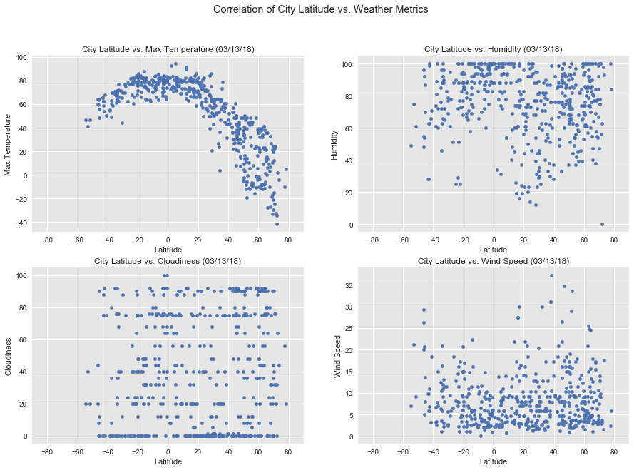

## Analysis

1. On South Hemisphere, there are much fewer cities at higher laptitude
2. On South Hemisphere, temperate drop slower with laptitude than North Hemisphere. This might be because the it is winter at North but summer at South right now.
3. Humidity level by average looks higher on North vs. South Hemisphere. This might also due to seasons.
4. No apparent patterns obsered from scatter plots for couldiness and wind speed

```python
import os
import json
import requests
import random
import pandas as pd
from datetime import date
import matplotlib.pyplot as plt
import seaborn as sns
from citipy import citipy

from config import WOM_API_KEY

class WeatherPy(object):
    
    _number_of_cities = None
    _cities_set = set()
    _cities_df = pd.DataFrame()
    _log_file = None
    _base_url = 'http://api.openweathermap.org/data/2.5/weather?units=Imperial&APPID=' + WOM_API_KEY + '&q='
    _today = date.today().strftime('%m/%d/%y')
    
    @property
    def cities(self):
        return self._cities_df.reset_index()[[
            'City Name', 'Country Code', 'Date',
            'Latitude', 'Longitude',
            'Humidity', 'Max Temperature', 'Cloudiness', 'Wind Speed'
        ]]

    @property
    def number_of_cities(self):
        return self._number_of_cities
      
    def __init__(self, 
                 number_of_cities=None,
                 log_file=None):
        self._number_of_cities = number_of_cities or 4 # Default to 4 for testing
        if log_file:
            self._log_file = open(log_file, 'w')
        sns.set()
        sns.set_style('darkgrid', {'axes.facecolor': '0.9'})
        
    def __del__(self):
        if self._log_file:
            self._log_file.close()

    def _pick_a_city(self, i):
        while True:
            lat, lon = (random.uniform(-90, 90), random.uniform(-180, 180))
            city = citipy.nearest_city(lat, lon)
            city_name = city.city_name
            country_code = city.country_code
            city_full = city_name + ',' + city.country_code

            self.log('Processing City # {} | {}'.format(i, city_full))

            # Check if city is already picked
            if city_full in self._cities_set:
                self.log('Skip duplicate {}'.format(city_full))
                continue
            
            # Check weather
            url = self._base_url + city_full
            self.log(url)
            response = requests.get(url)
            if response.status_code != 200:
                self.log('Weather not found for ' + city_full + '. Try another city.')
                continue

            w = response.json()
            #print(json.dumps(w, indent=2))
            self._cities_df = self._cities_df.append(
                pd.DataFrame([{
                        'City Name': city_name,
                        'Country Code': country_code,
                        'Date': self._today,
                        'Latitude': w['coord']['lat'],
                        'Longitude': w['coord']['lon'],
                        'Humidity': w['main']['humidity'],
                        'Max Temperature': w['main']['temp_max'],
                        'Wind Speed': w['wind']['speed'],
                        'Cloudiness': w['clouds']['all'],
                    }]
                )
            )

            self._cities_set.add(city_full)
            break
        
    def pick_all_cities(self):
        for i in range(self.number_of_cities):
            self._pick_a_city(i)
        
    def write_data_to_csv(self):
        self.cities.to_csv('weather_py.csv')
        
    def plot_lat_lon(self):
        fig, ax = plt.subplots(figsize=(10, 5))
        self.cities.plot.scatter('Longitude', 'Latitude', ax=ax)
            
        plt.xlim(-180, 180); plt.ylim(-90, 90)
        plt.show()
        
    def plot_weather(self):
        fig = plt.figure(figsize=(15,10))
        fig.suptitle("Correlation of City Latitude vs. Weather Metrics")

        for i, metric in [(1, 'Max Temperature'),
                          (2, 'Humidity'),
                          (3, 'Cloudiness'),
                          (4, 'Wind Speed')]:
            self.cities.plot.scatter(x='Latitude', y=metric, 
                                   title='City Latitude vs. {} ({})'.format(metric, self._today),
                                   ax=plt.subplot(2, 2, i),
                                   xlim=(-90, 90))                          

        fig.savefig('weather_py.png')
        plt.show()

    def log(self, msg):
        if self._log_file:
            self._log_file.write(msg + '\n')
            self._log_file.flush() # Easier to see progress in tail -f
        else:
            print(msg)
```


```python
weather_py = WeatherPy(number_of_cities=500, log_file='weather_py.log')
weather_py.pick_all_cities()
weather_py.write_data_to_csv()
```


```python
weather_py.cities.head()
```


<div>
<style>
    .dataframe thead tr:only-child th {
        text-align: right;
    }

    .dataframe thead th {
        text-align: left;
    }

    .dataframe tbody tr th {
        vertical-align: top;
    }
</style>
<table border="1" class="dataframe">
  <thead>
    <tr style="text-align: right;">
      <th></th>
      <th>City Name</th>
      <th>Country Code</th>
      <th>Date</th>
      <th>Latitude</th>
      <th>Longitude</th>
      <th>Humidity</th>
      <th>Max Temperature</th>
      <th>Cloudiness</th>
      <th>Wind Speed</th>
    </tr>
  </thead>
  <tbody>
    <tr>
      <th>0</th>
      <td>georgetown</td>
      <td>sh</td>
      <td>03/13/18</td>
      <td>-7.93</td>
      <td>-14.42</td>
      <td>100</td>
      <td>78.83</td>
      <td>0</td>
      <td>11.68</td>
    </tr>
    <tr>
      <th>1</th>
      <td>avarua</td>
      <td>ck</td>
      <td>03/13/18</td>
      <td>-21.21</td>
      <td>-159.78</td>
      <td>94</td>
      <td>78.80</td>
      <td>90</td>
      <td>3.36</td>
    </tr>
    <tr>
      <th>2</th>
      <td>atuona</td>
      <td>pf</td>
      <td>03/13/18</td>
      <td>-9.80</td>
      <td>-139.03</td>
      <td>100</td>
      <td>79.82</td>
      <td>88</td>
      <td>9.78</td>
    </tr>
    <tr>
      <th>3</th>
      <td>albany</td>
      <td>au</td>
      <td>03/13/18</td>
      <td>-35.02</td>
      <td>117.88</td>
      <td>85</td>
      <td>68.48</td>
      <td>92</td>
      <td>6.31</td>
    </tr>
    <tr>
      <th>4</th>
      <td>rikitea</td>
      <td>pf</td>
      <td>03/13/18</td>
      <td>-23.12</td>
      <td>-134.97</td>
      <td>100</td>
      <td>80.18</td>
      <td>20</td>
      <td>7.76</td>
    </tr>
  </tbody>
</table>
</div>


```python
weather_py.plot_lat_lon()
```


This match the map of the world pretty well.


```python
weather_py.plot_weather()
```





As observed, if using the original random latitude and longitude, there location on higer latitude will see biggest problem.

### Destruct object to clean up


```python
del weather_py
```
